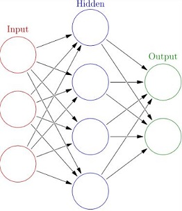
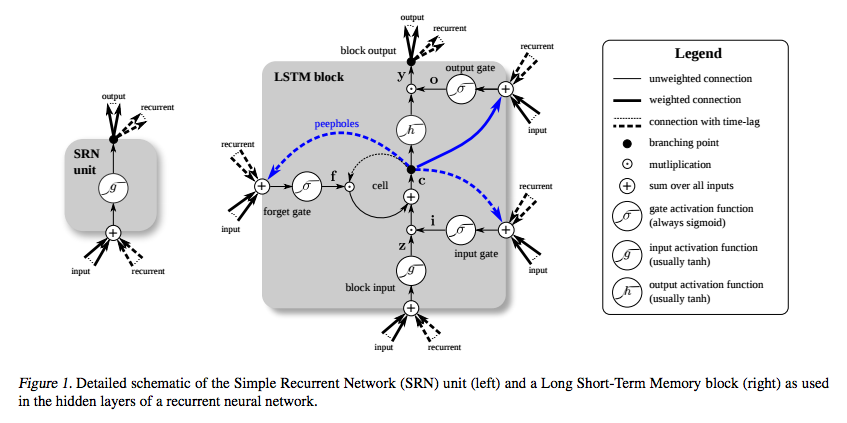
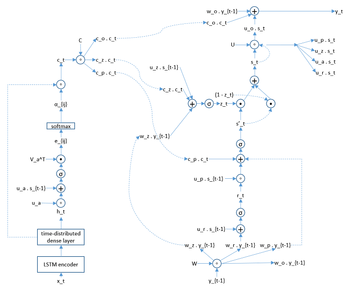
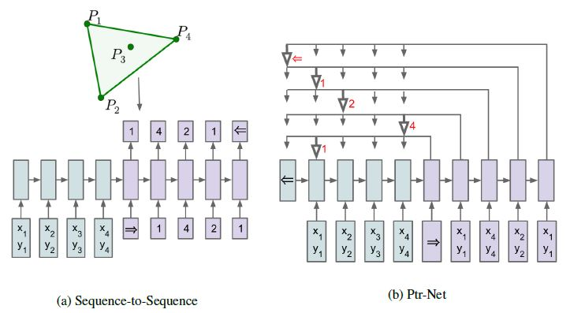
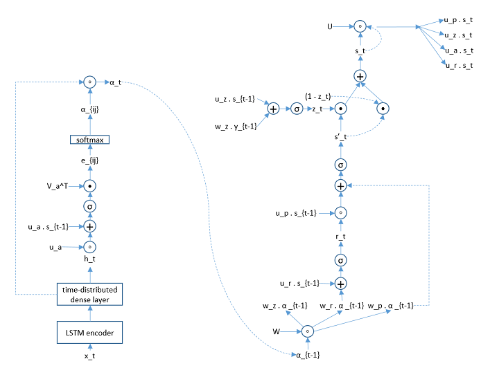
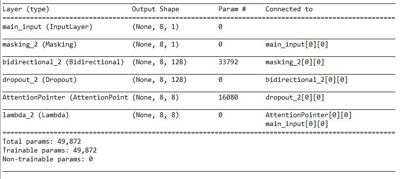
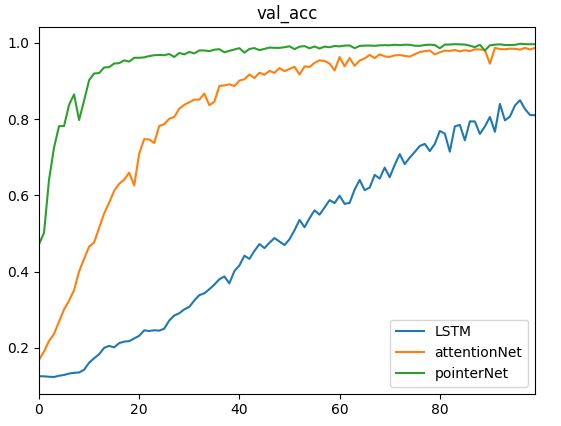
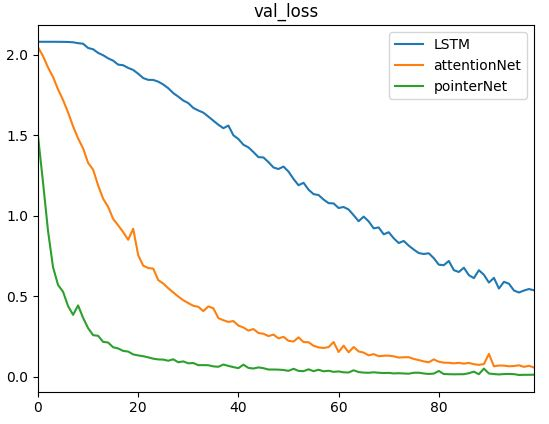

# pointerNetwork

**A custom layer in keras to implement a pointer network decoder**

## Recurrent neural network (RNN) for solving optimization problems 

Scheduling as an example.

### Very few words on neural networks (NN)

An NN is a layered structure of neurons that only has connections between different layers:



Every neuron receives an input, converts it through an activation function and nonlinear transformation into an output, and gives it to the connected neurons in the next layer.

An example:

Inputs $x_1, x_2, \dots x_j$ to neuron $k$, output is $y_k = \sigma \big( \Sigma_{j=0}^m w_{kj} x_j + b_{kj} \big)$, where $w$ is the weight, $b$ the bias, $\sigma$ is the activation function: when input is bigger than a threshold, the activation function "activates" the neuron to enable output; otherwise it stays "deactivated". Common activation functions include [hyperbolic tangent](https://en.wikipedia.org/wiki/Hyperbolic_function), [sigmoid](https://en.wikipedia.org/wiki/Sigmoid_function), etc.

The output is compared with a given target through a loss function. The loss function dictates the changes in neuron parameters (the direction and magnitude of changes) through [gradient descent](https://en.wikipedia.org/wiki/Gradient_descent). In this case, the parameters are the $w$'s and the $b$'s of all neurons. 

**backpropagation**：

How the loss function backpropagates through all layers to change the parameters of all neurons: for simplicity, we use mean squared error as loss function, or the Euclidean distance between output and target.

$E = \frac{1}{2n} \sum \parallel \text{ } y - \hat{y} \text{ } \parallel ^2$

$\hat{y}$ is algorithm output, or estimate of the target; $y$ is the actual target (what we want the algorithm to output, given the same inputs), $\parallel \text{ } \bullet \text{ } \parallel$ denotes the distance between the two vectors.

$\cfrac{\partial E}{\partial \hat{y}} = y - \hat{y}$

for simplification, we use logistic function as activation function:

$o_j = \sigma(z_j) = \cfrac{1}{1 + e^{-z_j}}$

$o_j$ is the output of layer $j$, $z_j$ is the weighted sum of previous layer $i$'s output $o_i$, before the activation: $z_j = \sum w_{ij} o_i + b_{ij}$, $w_{ij}$ are the weights used between layers i and j, $b_{ij}$ are the corresponding biases.

$\cfrac{\partial z_{ij}}{\partial w_{ij}} =  \cfrac{\partial \sum (w_{ij} o_i + b_{ij})}{\partial w_{ij}} = o_i$

$\cfrac{\partial o_j}{\partial z_j} = \cfrac{\partial \sigma(z_j}{\partial z_j} = \cfrac{e^z}{(1+e^z)^2}$

According to the chain rule of derivatives: $\cfrac{\partial E}{\partial w_{ij}} = \cfrac{\partial E}{\partial o_j} \cfrac{\partial o_j}{\partial z_j} \cfrac{\partial z_j}{\partial w_{ij}}$ 

if j is the last layer, $o_j = \hat{y}$ and $\cfrac{\partial E}{\partial o_j} = \cfrac{\partial E}{\partial \hat{y}}$

### RNN

A **recurrent** NN creates a loop that feeds back information from output layer to input layer. On the time scale, this serves as a sort of "memory". We use RNN for solving optimization problems, especially those involving sequencing, for example, scheduling.

A simple diagram of RNN:



(https://arxiv.org/pdf/1503.04069.pdf)

Modeling:

input at time t: $x^t$

N: number of LSTM neurons

M: input dimension

footnotes i, o, f, z：input gate, output gate, forget gate, block

trainable parameters:

input weight: $W_z, W_i, W_f, W_o \in \mathcal{R}^{N \times M}$

recurrence weight: $R_z, R_i, R_f, R_o \in \mathcal{R}^{N \times N}$

bias: $b_z, b_i, b_f, b_o \in \mathcal{R}^N$

equations:

input $z^t = \sigma \big( W_z x^t + R_z y^{t-1} + b_z \big)$

input gate $i^t = \sigma \big( W_i x^t + R_i y^{t-1} + b_i \big)$

forget gate $f^t = \sigma \big( W_f x^t + R_f y^{t-1} + b_f \big)$

cell $c^t = z^t \odot i^t + c^{t-1} \odot f^t$

output gate $o^t = \sigma \big( W_o x^t + R_o y^{t-1} + b_o \big)$

output $y^t = h \big( c^t \big) \odot o^t$

### Attention network：

This structure aligns inputs and outputs of a RNN, like telling you which part of that long memory is more relevant to the current task. It has been very successful in natural language processing applications. The original paper is [attention network, Bahdanau et. al.](https://arxiv.org/pdf/1409.0473.pdf). We apply the concept to scheduling as well.

Bahdanau et.al.'s attention network uses LSTM as encoder, whose output is the input to attention model, which adjusts the weight of decoder to align with encoder.

Decoder topology:



modeling:

encoder input $X = (x_1, \dots, x_{T_x}), x_i \in \mathcal{R}^{K_x}$

decoder output $Y = (y_1, \dots, y_{T_y}), y_i \in \mathcal{R}^{K_y}$

$K_x, K_y$ are input and output sets, $T_x, T_y$ are length of the input and output vectors. In attention network, the input and output sets, as well as the length can be different. Whereas in our scheduling problem, we have to have $K_x = K_y, T_x = T_y$.

Decoder:

hidden state $s_i = (1 - z_i) \circ s_{i-1} + z_i \circ \tilde{s}_i$

proposal state $\tilde s_i = \tanh \big(W_p y_{i-1} + U_p (r_i \circ s_{i-1}) + C_p c_i \big)$

update state $z_i = \sigma \big( W_z y_{i-1} + U_z s_{i-1} + C_z c_i \big)$

reset state $r_i = \sigma \big( W_r y_{i-1} + U_r s_{i-1} + C_r c_i \big)$

context vector $c_i = \sum\limits_{j=1}^{T_x} \alpha_{ij} h_j$

probability vector $\alpha_{ij} = \cfrac{\exp(e_{ij})}{\sum\limits_{k=1}^{T_x} \exp(e_{ik})}$

alignment vector $e_{ij} = v_a^T \tanh \big( W_a s_{i-1} + U_a h_j \big)$

where $h_j$ is encoder hidden state output.

Trainable variables are $W, U, C$ and $v_a^T$.

### Pointer network：

The above attention network and RNN with encoder-decoder structure has an output that is a different set from the input. This is different from the application in scheduling, where output is a permutation of the input, whose length changes with the input length.

[Pointer network](https://arxiv.org/pdf/1506.03134.pdf)adjusted the structure of the attention network, now the output sequence is a set of pointers back towards the input sequence.



(https://arxiv.org/pdf/1506.03134.pdf)

Compared to attention network, pointer network deleted the context vetor connections and $y_t$ and uses probability vector $\alpha_{t}$ as input to encoder and output from the algorithm.



### Implementation of pointer Network with sample code

Encoder uses keras LSTM. Decoder structure did not exist at the time of the project. I customized the RNN layer based on [keras](https://keras.io/#keras-the-python-deep-learning-library).

pointer network's customized NN layer inherits keras layer structure to ensure compatibility:

**Build**: executed before compilation. This function creates the network structure, including dimensions, memory states, trainable variables, initialization, etc.

**Call**: executed during compilation. In RNN, we use **step** function for the recurrent calculations; in my project I use the Call function in pointer network to connect encoder hidden states to decoder (the time-distributed dense layer), to reduce compuation load in recurrence.

**Step**: The most important calculation happens here. Input to the function is standard for RNN: (output, [hidden state, cell state], the second array has to be a symbolic variable for recurrence, to enable backpropagation. In my pointer network, similar to the standard LSTM output format (output, [hidden state, cell state]), we return the probability vector $\alpha$ in the first element, and the arrays [update state z, reset state r] in the second element.

Build Sample code:

```python
def build(self, input_shape):
    """ input_shape: shape of the encoder output. 
        Assuming the encoder is an LSTM, 
        input_shape = (batchsize, timestep, encoder hiddensize)          
    """

    self.batch_size, self.timesteps, self.input_dim = input_shape
    self.output_dim = self.timesteps

    if self.stateful:
        super(AttentionPointer, self).reset_states()

    self.states = [None, None]  # z, s_p

    # Matrices for creating the probability vector alpha
    self.V_a = self.add_weight(shape=(self.output_dim,),
                               name='V_a',
                               initializer=self.kernel_initializer,
                               regularizer=self.kernel_regularizer,
                               constraint=self.kernel_constraint)
    self.W_a = self.add_weight(shape=(self.units, self.output_dim),
                               name='W_a',
                               initializer=self.kernel_initializer,
                               regularizer=self.kernel_regularizer,
                               constraint=self.kernel_constraint)
    self.U_a = self.add_weight(shape=(self.input_dim, self.output_dim),
                               name='U_a',
                               initializer=self.kernel_initializer,
                               regularizer=self.kernel_regularizer,
                               constraint=self.kernel_constraint)
    self.b_a = self.add_weight(shape=(self.output_dim,),
                               name='b_a',
                               initializer=self.bias_initializer,
                               regularizer=self.bias_regularizer,
                               constraint=self.bias_constraint)

    # Matrices for the r (reset) gate
    self.U_r = self.add_weight(shape=(self.units, self.units),
                               name='U_r',
                               initializer=self.recurrent_initializer,
                               regularizer=self.recurrent_regularizer,
                               constraint=self.recurrent_constraint)
    self.W_r = self.add_weight(shape=(self.output_dim, self.units),
                               name='W_r',
                               initializer=self.recurrent_initializer,
                               regularizer=self.recurrent_regularizer,
                               constraint=self.recurrent_constraint)
    self.b_r = self.add_weight(shape=(self.units, ),
                               name='b_r',
                               initializer=self.bias_initializer,
                               regularizer=self.bias_regularizer,
                               constraint=self.bias_constraint)

    # Matrices for the z (update) gate
    self.U_z = self.add_weight(shape=(self.units, self.units),
                               name='U_z',
                               initializer=self.recurrent_initializer,
                               regularizer=self.recurrent_regularizer,
                               constraint=self.recurrent_constraint)
    self.W_z = self.add_weight(shape=(self.output_dim, self.units),
                               name='W_z',
                               initializer=self.recurrent_initializer,
                               regularizer=self.recurrent_regularizer,
                               constraint=self.recurrent_constraint)
    self.b_z = self.add_weight(shape=(self.units, ),
                               name='b_z',
                               initializer=self.bias_initializer,
                               regularizer=self.bias_regularizer,
                               constraint=self.bias_constraint)

    # Matrices for the proposal
    self.U_p = self.add_weight(shape=(self.units, self.units),
                               name='U_p',
                               initializer=self.recurrent_initializer,
                               regularizer=self.recurrent_regularizer,
                               constraint=self.recurrent_constraint)
    self.W_p = self.add_weight(shape=(self.output_dim, self.units),
                               name='W_p',
                               initializer=self.recurrent_initializer,
                               regularizer=self.recurrent_regularizer,
                               constraint=self.recurrent_constraint)
    self.b_p = self.add_weight(shape=(self.units, ),
                               name='b_p',
                               initializer=self.bias_initializer,
                               regularizer=self.bias_regularizer,
                               constraint=self.bias_constraint)

    # For creating the initial state:
    # input to the pointer network is its own output, therefore
    # use output_dim to initialize states.
    self.W_s = self.add_weight(shape=(self.output_dim, self.units),
                               name='W_s',
                               initializer=self.recurrent_initializer,
                               regularizer=self.recurrent_regularizer,
                               constraint=self.recurrent_constraint)

    self.input_spec = [
        InputSpec(shape=(self.batch_size, self.timesteps, self.input_dim))]
    self.built = True
```

Call sample code:

```python
def call(self, x):        
    # x is the hidden state of encoder.
    self.x_seq = x

    # a_ij = softmax(V_a^T tanh(W_a \cdot s_{t-1} + U_a \cdot h_t))
    # apply a dense layer over the time dimension of the sequence 
    # (get the U_a \cdot h_t) part).
    self._uxpb = _time_distributed_dense(self.x_seq, self.U_a, b=self.b_a,
                                         input_dim=self.input_dim,
                                         timesteps=self.timesteps,
                                         output_dim=self.output_dim)        
    x = self._uxpb        
    return super(AttentionPointer, self).call(x)
```

Step sample code:

```python
def step(self, x, states):
    """ get the previous hidden state of the decoder from states = [z, s_p]
        alignment model:
            waStm1 = W_a \dot s_{t-1}
            uaHt = U_a \dot h_t
            tmp = tanh(waStm1 + uaHt)
            e_ij = V_a^T * tmp
            vector of length = timestep is: u_t = softmax(e_tj)
    """
    atm1 = x
    ztm1, s_tpm1 = states

    # old hidden state:
    # shape (batchsize, units)
    stm1 = (1 - ztm1) * self.stm2 + ztm1 * s_tpm1

    # shape (batchsize, timesteps, units)
    _stm = K.repeat(stm1, self.timesteps)

    # shape (batchsize, timesteps, output_dim)
    _Wxstm = K.dot(_stm, self.W_a)

    # calculate the attention probabilities:
    # self._uxpb has shape (batchsize, timesteps, output_dim)
    # V_a has shape (output_dim, )
    # after K.expand_dims it is (output_dim, 1)
    # therefore et has shape (batchsize, timesteps, 1)
    et = K.dot(activations.tanh(_Wxstm + self._uxpb),
               K.expand_dims(self.V_a))
    at = K.exp(et)
    at_sum = K.sum(at, axis=1)
    at_sum_repeated = K.repeat(at_sum, self.timesteps)
    at /= at_sum_repeated  # vector of shape (batchsize, timesteps, 1)

    # reset gate:
    rt = activations.sigmoid( K.dot(atm1, self.W_r) + K.dot(stm1, self.U_r)
                              + self.b_r )
    # update gate:
    zt = activations.sigmoid( K.dot(atm1, self.W_z) + K.dot(stm1, self.U_z)
                              + self.b_z )
    # proposal hidden state:
    s_tp = activations.tanh( K.dot(atm1, self.W_p) 
                             + K.dot((rt * stm1), self.U_p) + self.b_p )
    yt = activations.softmax(at)

    if self.return_probabilities:
        return at, [zt, s_tp]
    else:
        return yt, [zt, s_tp]
```

The custom layer class is too much code. Please go to the file for details.

### LSTM, attention network, pointer network performance comparison on a very simple scheduling problem:

**Test case**：

Random generated 8-digit integer sequence (10k of data points):

x0|x1|x2|x3|x4|x5|x6|x7
--|--|--|--|--|--|--|--
9|7|4|1|6|2|5|3
9|2|4|1|3|8|7|0
5|9|1|0|8|3|2|4
9|5|3|1|2|7|0|6
7|3|1|9|0|8|2|4
6|4|8|7|1|0|2|3
4|8|1|2|9|5|6|3
6|5|7|8|0|3|4|1
8|9|7|0|1|3|2|5
3|9|6|2|0|7|4|1

Target output is the original sequence in descending order.

Create the model:

```python
main_input = Input(shape=(n_steps, 1), name='main_input')
masked = Masking(mask_value=-1)(main_input)
enc = Bidirectional(LSTM(hidden_size, return_sequences=True), merge_mode='concat')(masked)
dropout = Dropout(rate=dropoutRate)(enc)
dec = AttentionPointer(hidden_size, return_probabilities=True)(dropout)
model = Model(inputs=main_input, outputs=dec)
model.summary()
```



**Test result**：

Encoders are all bidirectional LSTM. Decoders are LSTM，attention network and pointer network, respectively.

Prediction accuracy is the percentage of correctly sequenced elements.

Prediction accuracy:



Loss:



Sample output from pointer network:

y0|y1|y2|y3|y4|y5|y6|y7
--|--|--|--|--|--|--|--
8|7|6|5|4|3|2|1
8|7|5|4|3|2|1|0
9|8|6|5|3|2|1|0
9|8|7|6|4|3|2|0
9|8|6|5|4|3|2|1
8|7|6|5|4|3|1|0
9|8|7|6|4|3|2|0
9|8|7|6|3|2|1|0
9|8|7|4|3|2|1|0
9|8|7|4|3|2|1|0

It is obvious that pointer network has higher accuracy with faster convergence.

